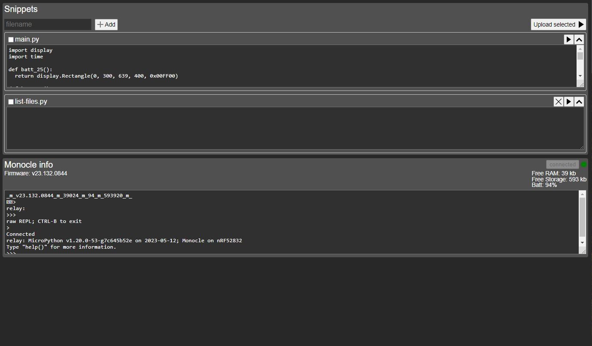

### About

This is a very basic web-editor that can combine scripts stored in local storage and write to monocle flash.

Still mostly conceptual since unsure how it will all work regarding what would make sense logic wise.

There is mobile support (basic responsive design)



### Live Demo

View github pages build <a href="https://jdc-cunningham.github.io/bl-monocle-reactjs-pwa/">here</a>

### Basic instructions

- connect to your monocle
- write python (mpython) as a snippet
  - run single snippet (play icon)
  - or write to flash
    - need main.py
    - separate file(s) for modules

Use

```
import os
os.listdir("/")
```

To verify written files, and read contents

### LocalStorage

That's where the code snippets are stored as a basic stringified JSON object

### Check other branches

Has different sample code

### Disclaimer

This does not have a linter (does not understand code). Also does not feature code highlighting.

This assumes whatever code you're writing will work and if there are errors you'll only see them during the upload process (writing to monocle).
